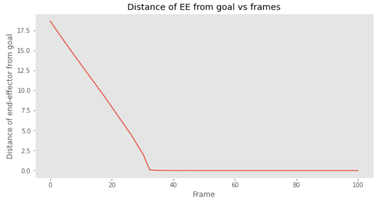
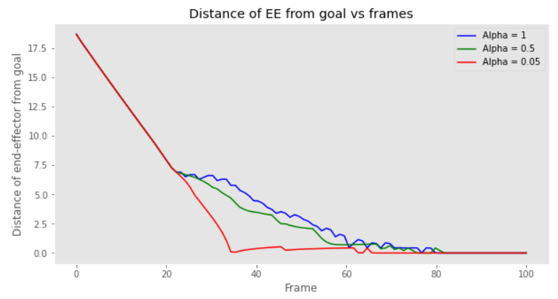
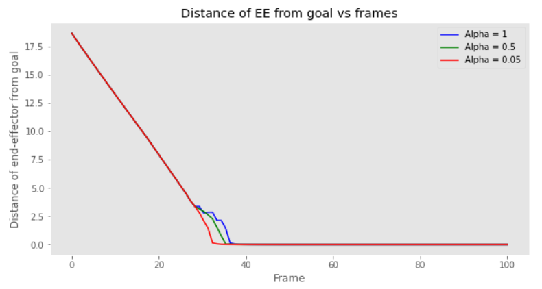
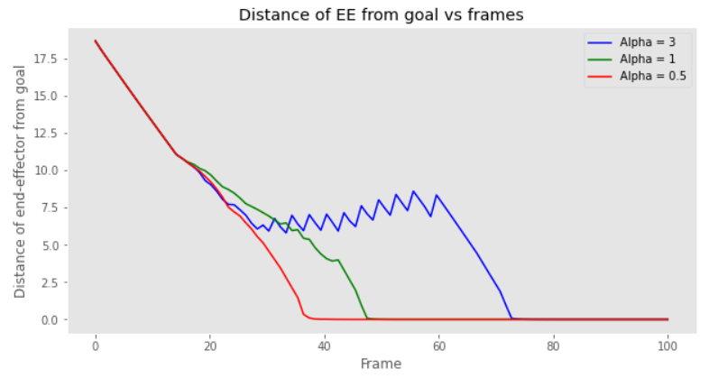
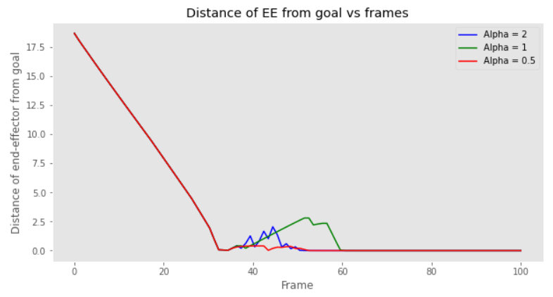
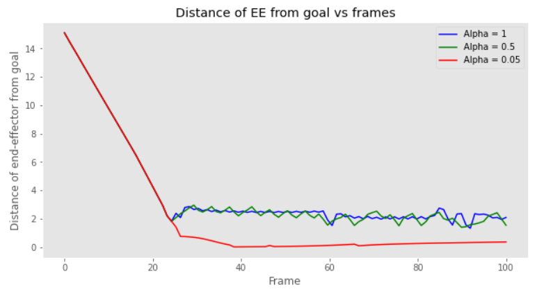

# Obstacle Avoidance for Kinematically Redundant Mobile Manipulators

**Project Description**  
In order for a mobile manipulator to execute its task smoothly, it must take
into account environment variables such as moving agents or obstacles. This
can be done by moving the manipulator into a configuration that is atleast at a
threshold distance from obstacles. To make sure this motion doesn’t affect the
movement of the end-effector, redundant degrees of freedom have to be utilized
to achieve collision-free configuration. The amount of flexibility depends on the
degree of redundancy, i.e., on the number of redundant DOFs. Redundancy is
defined as the difference between the required and available DOFs. The execution of obstacle avoidance is of prime importance in tasks such as spray painting,
arc welding, etc.  

The goal of this project is to utilize redundant degrees of freedom of a 6-link
mobile manipulator to tackle the problem of obstacle avoidance. The endeffector of the manipulator with stationary base is subject to obstacles in its
path to a goal pose. The primary objective of this project is to avoid coming in
contact with obstacles under different scenarios.  

**Project Contribution**  
The two main goals performed by the manipulator with stationary base are :  
- **End-Effector Motion** - The redundant manipulator’s end-effector should reach
the desired final destination from a given initial position.  
- **Obstacle Avoidance** - The mobile robot should avoid obstacles along the
path traversed without colliding. We assume that the links of manipulator arm
are not counted as obstacles, so they are free to overlap.  

The above goals were achieved for the following scenarios:  
• Scenario I : End-effector motion in the absence of obstacles  
• Scenario II : Manipulator arm motion disturbed by the stationary obstacle  
• Scenario III : End-effector motion disturbed by the stationary obstacle  
• Scenario IV : Manipulator motion disturbed by moving obstacle    

**Results**  
The algorithm is evaluated based on four scenarios. For the sake of simplicity,
we use a single circular obstacle for each scenario. The obstacle is represented
by the blue circle. The goal is represented as the red dot. The plot of distance
of EE from goal is given to evaluate the smoothness of the end-effector path as
we vary the alpha value.  

The algorithm was repeated multiple times using random positions of the goal
pose, random initial joint angles and random centres of the obstacle. The results of this experiment are presented in table 1. The two variables we consider
are- whether collision occurs and whether the end-effector reaches the goal pose.    

**Scenario 1:** In the first scenario, no obstacle is present. This scenario gives an estimate of the natural path of the end-effector in the absence of obstacles. Any deviations from this path will be evaluated in the subsequent scenarios. For the no obstacle scenario, the plot in Figure 1 is a linear one, given the value of alpha is 1.   
    
  

**Scenario 2:** In this scenario, an obstacle is placed in a position so as to make the manipulator go around it to reach the goal pose. The manipulator is successful in reaching the goal while avoiding the obstacle, as can be observed in the results. The distance vs frame plots in Figure 2 are given for values of alpha 1, 0.5 and 0.05.  
    
  
  
  

**Scenario 3:** In this scenario, an obstacle is placed directly on the path of
the end-effector. The end-effector successfully reaches the goal pose after deviating from its path, just enough to avoid the obstacle. The distance vs frame
plots in Figure 3 are given for values of alpha 1, 0.5 and 0.05.  
    
  
  
  

**Scenario 4:** This scenario consists of two runs of the program. In the first
run, a moving obstacle is orchestrated to move diagonally such that it doesn’t
cross the path of the end-effector. The movement of the manipulator is given
for values of alpha 3, 1 and 0.5 (See Figure 4).  
    
  
  
  

In run 2, the moving obstacle is made to cross the path of the end-effector. This time the program takes the alpha values 2, 1 and 0.5 (See Figure 5).    
    
  
  
  

**Failure scenario:** There are scenarios where the end-effector fails to reach
the goal pose. One such scenario is presented in Figure 6 and the alpha value
is set as 1.  
  
  
